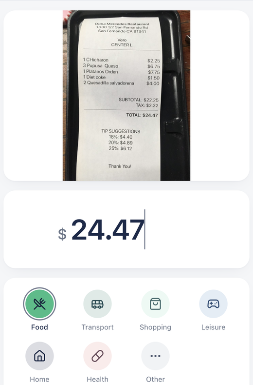
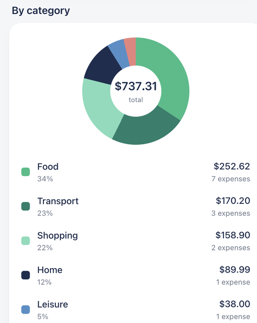

# Receipt Expense Analytics

An end-to-end pipeline that turns photographs of paper receipts into a queryable ledger
and a monthly spending analysis.

```
188 receipt photos  →  vision-model extraction  →  typed, validated schema
                    →  Postgres  →  deterministic monthly metrics  →  dashboard
```

Two things live in this repository, and they were built in that order:

- **A receipt image dataset** — `receipt-image-dataset-1` to `-4`, 188 photos of real
  receipts, collected first
- **An expense tracker built on top of it** — `web/` + `api/` + `supabase/`

The dataset is what makes the second half honest: extraction accuracy was checked
against real photographs rather than clean synthetic samples, and the section below is
explicit about how far that check actually goes.

| Screens | | |
| --- | --- | --- |
|  |  |  |
| Extraction, before confirmation | Generated insights | Category breakdown |

---

# 1. The data

188 JPEGs across four directories, named `<number>-receipt.jpg`:

| Directory | Images | Number range |
| --- | --- | --- |
| `receipt-image-dataset-1` | 34 | 1000–1032 |
| `receipt-image-dataset-2` | 51 | 1033–1093 |
| `receipt-image-dataset-3` | 53 | 1094–1145 |
| `receipt-image-dataset-4` | 54 | 1146–1199 |

Numbering runs continuously across the directories, 1000–1199. Twelve numbers were
deleted along the way (see the run of `Delete xxxx-receipt.jpg` commits in the history),
which is why there are 188 images rather than 200. No number appears twice — the gaps
are deletions, not duplicates.

Each directory also holds a 1-byte `temp` file. Git won't track an empty directory, so
these keep the directories alive as images get removed.

**Characteristics that matter for extraction.** These are real-world photos and scans,
not scanned documents under controlled lighting. Sizes and orientations vary — a sample
ranged from 338×450 to 1000×903 — and plenty are shot at an angle, have glare across the
paper, or are creased. Receipts are also a hostile layout for a reader: narrow columns,
inconsistent label wording (`TOTAL` vs `AMOUNT DUE` vs `BALANCE`), a subtotal sitting
directly above the total, and tax and tip lines in between. That is exactly what makes
the set useful.

> The repository does not record where these images came from or under what licence.
> Check with the repository owner before using them commercially or redistributing them.

---

# 2. Extraction and how far it has been validated

## The pipeline

1. Browser downscales the photo (`web/src/lib/image.ts`)
2. `POST /api/recognize` — the backend converts to JPEG, corrects EXIF orientation and
   resizes to a 1600px long edge. Receipts are narrow strips; 1600px is enough to read
   the print, and anything larger only burns tokens.
3. OpenAI `gpt-4o` returns structured fields under a strict `response_format`
4. `normalize()` converts the model's sentinels back into real nulls
5. **A human confirms the parsed fields in a form before anything is written**
6. The row is written to Postgres; the original image goes to object storage

Step 5 is not optional. A misread total corrupts the ledger silently and every
downstream metric inherits the error, whereas glancing at four fields costs a second.

## The schema contract

Every field in the model's `response_format` is **required and non-nullable**, using
`""` / `0` / `"unknown"` to mean "couldn't read it" rather than `Optional`. That is both
what OpenAI's strict mode demands — every property must appear in `required` — and a way
to avoid the `anyOf` that nullable fields produce. Real nulls are restored afterwards by
`normalize()` in `api/app/schemas.py`, which also validates on the way through:
non-positive amounts become null (the column has a `check (total_amount > 0)`, so
letting them past only earns a rejection from the database), dates are parsed against
the real calendar — the model occasionally returns a `2026-02-30` — currency is matched
against `^[A-Z]{3}$`, and line items with no name are dropped.

So a null in the database means "the model could not read this", and a value means the
model committed to something a human then accepted. Those are different states and the
analysis layer relies on being able to tell them apart.

> The `ExtractedReceipt` docstring and every `Field(description=...)` get folded into
> the `response_format` sent to the model — **they are prompt, not comments.**
> Implementation notes belong in `#` comments.

## What was actually measured

The prompt was tuned against five images (1012 / 1040 / 1093 / 1112 / 1178). On those
five, every core field — date, total, currency, category, payment method and line-item
count — matched a hand-checked answer key.

**The honest reading of that result:**

| | |
| --- | --- |
| Sample size | 5 of 188 (2.7%) |
| Composition | All five are US restaurant receipts — USD, food category |
| Selection | Chosen during tuning, not sampled at random |
| Therefore | This is a smoke test, not an accuracy estimate. It shows the pipeline works on one receipt type. It says nothing about UK supermarkets, petrol stations, non-USD currencies, or the harder photos in the set. |

The remaining 183 images are right here, which is the point of keeping them. Widening
the sample means building an answer key for a stratified sample — by country, merchant
type and photo quality — and reporting per-field accuracy separately, since `total` and
`date` are the fields the ledger actually depends on and `category` is a judgement call
even for a human.

To run extraction against any image:

```bash
curl -s -X POST http://localhost:8000/api/recognize \
  -F "file=@receipt-image-dataset-1/1012-receipt.jpg" | python3 -m json.tool
```

---

# 3. The analysis layer

Everything in `web/src/lib/analytics.ts` and `advice.ts` is a pure function over the
loaded rows — a few hundred rows a year fits in memory, so this is cheaper than a round
trip and removes a cache-invalidation problem.

## Metric definitions

| Metric | Definition | Edge case it handles |
| --- | --- | --- |
| `total` | Sum of `total_amount` for the month, **base currency only**, rounded to 2dp | Currency mixing (below) |
| `count` | All rows in the month, including foreign-currency rows excluded from `total` | Count and total deliberately disagree; the UI says why |
| `share` | Category total ÷ month total | Returns 0, not `NaN`, when the month total is 0 |
| `previousTotal` | Prior month's total | `null` when the prior month has no base-currency rows — absent ≠ zero |
| `changeRatio` | (total − previous) ÷ previous | `null` when previous is `null` or 0; no percentage change from a zero base |
| `dailyAverage` | total ÷ days | Current month divides by **days elapsed**, past months by days in month — otherwise every month looks cheap on the 2nd |
| `topMerchant` | Largest merchant by summed amount | Blank and whitespace-only names skipped rather than grouped |
| `monthlyTrend` | Trailing 6 months | Months with no records are filled with 0 so the line stays continuous |

**Currencies are never blended.** The base currency is USD. A foreign-currency receipt
is stored with its original currency recorded faithfully, but no FX conversion is
applied and it is **excluded from every total**; the months where one appears list the
currency separately. Adding £ to $ at an unstated rate produces a number that looks
precise and is meaningless. Excluding and flagging is the smaller lie.

**Categories are stored as slugs** (`food`, `transport`, …); labels, icons and colours
live only in `web/src/constants/categories.ts`. Aggregation resolves through
`getCategory()` rather than the raw stored string, so an unrecognised historical value
folds into `other` instead of producing several distinct rows all labelled "Other". The
UI was switched from Chinese to English without touching a single stored row — precisely
the case this split was meant to absorb.

## Insights are rules, not a model

`advice.ts` derives the written observations. Every one is a deterministic rule with an
explicit threshold and no LLM involvement, because a conclusion about someone's money
has to be reproducible and checkable against the ledger. A model inventing "your dining
is up 43%" is worse than giving no advice at all.

| Rule | Fires when | Threshold, and why |
| --- | --- | --- |
| Projection | Run rate × days in month, compared to last month | Needs ≥3 records and ≥5 days elapsed; ±8% counts as flat, because extrapolation this early is mostly noise |
| Category surge | Largest **absolute** month-on-month increase | Must be ≥10% of the month total. Absolute, not percentage: $5 → $10 is +100% and not worth saying |
| Recurring costs | Merchant appears in ≥3 of the trailing 4 months | Every amount within ±6% of the median. This tolerance is the only reliable line between a subscription and a shop you happen to visit monthly — at ±25%, groceries get labelled "renews automatically", which is misleading rather than merely wrong |
| Improving | Three consecutive declining months | All three must be non-zero, so a gap month can't fake a downward trend |
| Outlier | Largest expense ≥3× the month's **median** | Median, not mean — the mean is dragged up by the outlier being tested |
| Small purchases | A category with ≥5 records whose mean is below the month median | Individually painless, collectively not |

Each rule returns a conclusion with the figures behind it, or returns nothing. When the
data doesn't support a statement, silence beats a true-but-empty sentence. At most four
are shown at once; more than that and the important one gets buried.

---

# 4. Running it

## Stack

Two backends, and that split is the thing to understand first:

```
                    ┌──────────────────────────────┐
                    │   web/  React SPA (browser)  │
                    └───────┬──────────────┬───────┘
    POST image (recognize)  │              │  CRUD + uploads (direct)
                    ┌───────▼──────┐  ┌────▼─────────────────┐
                    │ api/ FastAPI │  │ Supabase             │
                    │      ↓       │  │  Postgres + Storage  │
                    │ OpenAI gpt-4o│  │  RLS                 │
                    └──────────────┘  └──────────────────────┘
```

FastAPI turns one photo into structured fields and **never touches the database**.
Ledger data goes straight from the browser to Supabase on the anon key; RLS is the real
boundary.

| | |
| --- | --- |
| **Frontend** (`web/`) | React 19 · TypeScript · Vite 8 · Tailwind CSS 4 · React Router 7 · Zustand · Recharts · `@supabase/supabase-js` |
| **Extraction API** (`api/`) | Python 3.13 · FastAPI · Uvicorn · OpenAI `gpt-4o` · Pydantic Settings · Pillow + pillow-heif |
| **Database** (`supabase/`) | Postgres — `receipts`, `receipt_items`, RLS, private Storage bucket |

Schema notes field by field, the design-token setup and the frontend directory layout
are in [`TECH-STACK.md`](TECH-STACK.md) (written in Chinese).

## First-time setup

**1. Database.** Paste the whole of `supabase/schema.sql` into the Supabase dashboard →
SQL Editor and run it. The file is idempotent, so just re-run it after any change.

**2. Frontend environment.**

```bash
cp web/.env.example web/.env.local
```

Fill in the Project URL and anon public key from the Supabase dashboard →
Project Settings → API.

**3. Backend environment.**

```bash
cp api/.env.example api/.env
```

Fill in an [OpenAI](https://platform.openai.com/api-keys) API key. Extraction reads
images, so the model has to support vision input — the default is `gpt-4o`.

You can run without a key; `/scan` will just return 503. Manual entry is unaffected.

> Both `.env` and `.env.local` are gitignored. The anon key is fine in the frontend
> bundle — RLS is the real boundary — but `OPENAI_API_KEY` and the `service_role` key
> must never leave `api/.env`.

## Running

After a fresh clone, install dependencies first:

```bash
cd web && npm install
cd ../api && python3 -m venv .venv && .venv/bin/pip install -r requirements.txt
```

Then two terminals:

```bash
# backend → http://localhost:8000
cd api && .venv/bin/uvicorn app.main:app --reload --port 8000

# frontend → http://localhost:5173
cd web && npm run dev
```

Both dots green in the "Connection" panel on the home screen means you're set up.

## Testing on a real phone

The frontend already sets `host: true`, so `npm run dev` prints a Network address like
`http://192.168.x.x:5173`. Open that on a phone on the same WiFi. Two more changes are
needed:

1. Append `http://192.168.x.x:5173` to `CORS_ORIGINS` in `api/.env`
2. Point `VITE_API_BASE_URL` in `web/.env.local` at `http://192.168.x.x:8000`

The backend also has to be started with `--host 0.0.0.0` to be reachable from the phone.

---

# 5. Known limitations

- **Extraction accuracy is unmeasured beyond n=5**, and those five share one receipt
  type. See section 2.
- **No FX conversion**, so a month containing foreign receipts reports an understated
  total. It is flagged in the UI rather than silently corrected.
- **Category assignment comes from the model** and is accepted or corrected by hand at
  entry. There is no measurement of how often it needs correcting, which would be the
  first thing worth instrumenting.
- **Insight thresholds are reasoned, not fitted.** ±8%, 10%, ±6%, 3× — each has an
  argument behind it in the table above, but none has been tuned against outcomes,
  because that needs more months of data than this ledger has.
- **RLS is enabled but the MVP policy lets any anon key holder read and write
  everything.** Section 4 of `supabase/schema.sql` already contains the per-`user_id`
  policies to swap in; no table changes are required.
